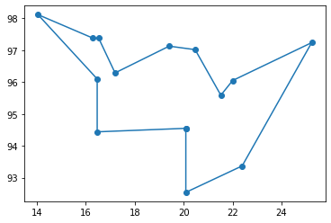
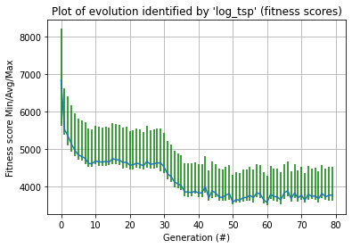

#  GENETIC ALGORITHMS FOR SOLVING TSPS

**Haute Ecole d'Ingénierie et de Gestion du Canton de Vaud**

**Machine learning**: June 2020

> Simon Mirkovitch, Tiago Povoa Quinteiro

**Professor: Perez-Uribe Andres**
**Assistant: Satizabal Mejia Hector Fabio**

## 6.1 Overview

> Briefly explain the problem and your solution (1/2 page).

### Problem

The travelling salesman problem (TSP) is about trying to find the shortest tour that passes in each city exactly once and returns to the starting point. It can be modeled as a graph problem. Finding the exact solution is a NP problem.

The cities are the points of the graph. In this case, there are 14 cities of Republic of the Union of Myanmar with 2 vectors (one with the latitudes and the other with the longitudes). 

```
LAT = [16.47, 16.47, 20.09, 22.39, 25.23, 22.00, 20.47, 
       17.20, 16.30, 14.05, 16.53, 21.52, 19.41, 20.09]

LON = [96.10, 94.44, 92.54, 93.37, 97.24, 96.05, 97.02, 
       96.29, 97.38, 98.12, 97.38, 95.59, 97.13, 94.55]
```

We also need to consider that the surface of the Earth is an oblate spheroid, not flat. 

### Solution

There is a lot of ways to approach this problem, some related to optimization. As we mentioned, finding the exact solution is difficult. But we can find a "good enough" solution with a heuristic method.

For this assignment, we're using a genetic algorithm. Note: It isn't specifically designed for this task.

We encode in the genes a possible path and evaluate some selection criteria, in our case the distance.

As for libraries, we used **pyevolve** and **geopy**

## 6.2 

> Provide the better route you found and the shortest path in kilometers. Is it the optimal shortest path ? explain.

The better route we found was: `[5, 11, 6, 12, 7, 10, 8, 9, 0, 1, 13, 2, 3, 4]`. 

Translated into coordinates we got the following:

```
[(20.09, 94.55), (20.09, 92.54), (22.39, 93.37), (25.23, 97.24), (22.0, 96.05), (21.52, 95.59), (20.47, 97.02), (19.41, 97.13), (17.2, 96.29), (16.53, 97.38), (16.3, 97.38), (14.05, 98.12), (16.47, 96.1), (16.47, 94.44), (20.09, 94.55)]
```

The total distance of this tour is: **3346.761974 km**



Above we can see the plot of the tour. A good indicator of a bad solution would be a crossing path. If you want to convince yourself, you can further read about triangle inequality. 

In the solution above, we don't have any. However, it is not sufficient to prove that this solution is the best. The only way to be certain, would be to test every way of arranging  these coordinates (all shuffles).

## 6.3

> Describe your fitness function

Our fitness function evaluates the total distance of a given path (here laying inside the chromosome).

```python
def fitness(chromosome):
    distance = tour_length(DISTANCE_MATRIX, chromosome)
    return distance
```

Then, we have to minimize this distance.

To reduce a bit the duration of the process, we have calculated a distance matrix beforehand. 

This matrix is a **symmetric** 2D array of distances between each possible A and B pair of cities.

As for the distance itself, we use **geopy**:

```python
def geodesic_distance(cityA, cityB):
    """
    return the geodesic distance between A and B in km.
    """
    return geodesic(cityA, cityB).km
```

## 6.4

> Explain the way you encoded the solution, give a chromosome example.

Every genome is a list of 14 unique integers from 0 to 13.

As an example: `[13, 2, 3, 4, 5, 11, 6, 12, 7, 10, 8, 9, 0, 1]`

Each integer represents an index we can translate into concrete coordinates (LAT, LON).

## 6.5

> Provide the configuration of the GA you finally used to find your better results: mutation, crossover, population size, type of selection, mutation, crossover used, number of generations. Describe the methodology or experiments performed in order to get your better results.

In our methodology, the first steps were made by following the suggested values in both class and online examples. Then, we used `pyevolve_graph` to see the evolution of the fitness score by generations.

So we ran multiple times the process, and observed the curve of evolution. The goal was to identify if we had a diminishing curve of fitness over time. 

**Hyper parameters**

```GENERATIONS = 200
GENERATIONS = 80
CROSSOVER_RATE = 0.8
MUTATION_RATE = 0.03 
POPULATION_SIZE = 100
FREQ_STATS = 100
```

Other parameters: we used `setElitism(True)`. We also tested `Selectors.GRouletteWheel` but it didn't work as well as the default parameter.

We also had to implement a custom `Initializator`. For this we followed the example of the official documentation. Our **G1DList TSP Initializator** allows us to initialize the array of integers (shuffled) without any duplicate.

## 6.6

> Provide relevant plots of your experiments and explanations.

Here we can see the diminishing curve of evolution of fitness over generations.



...


## 6.7

> Conclusions (1/2 page) + [optional] eventual supplementary comments (1/2 page) 

...

## Source:

http://pyevolve.sourceforge.net/examples.html#example-12-the-travelling-salesman-problem-tsp

